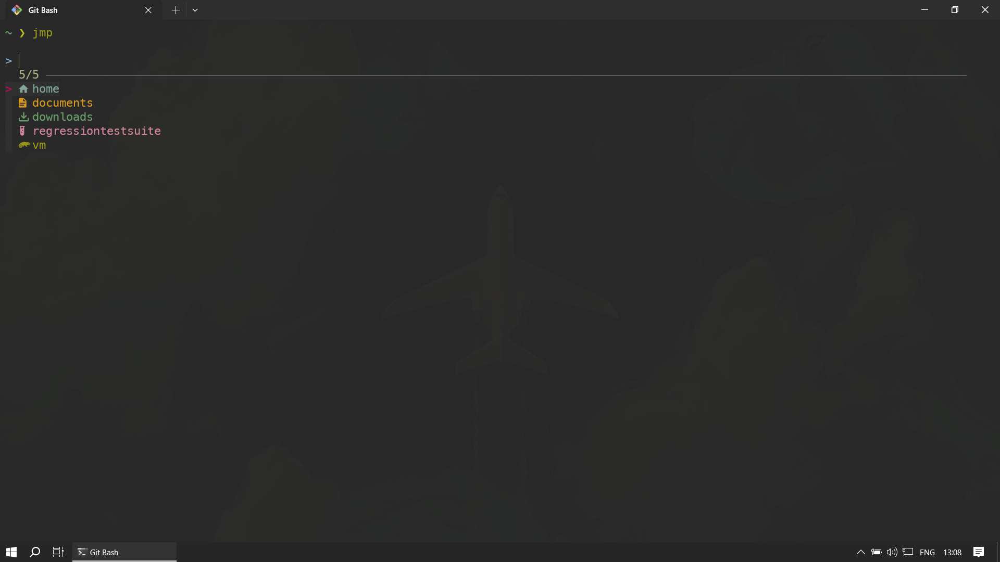
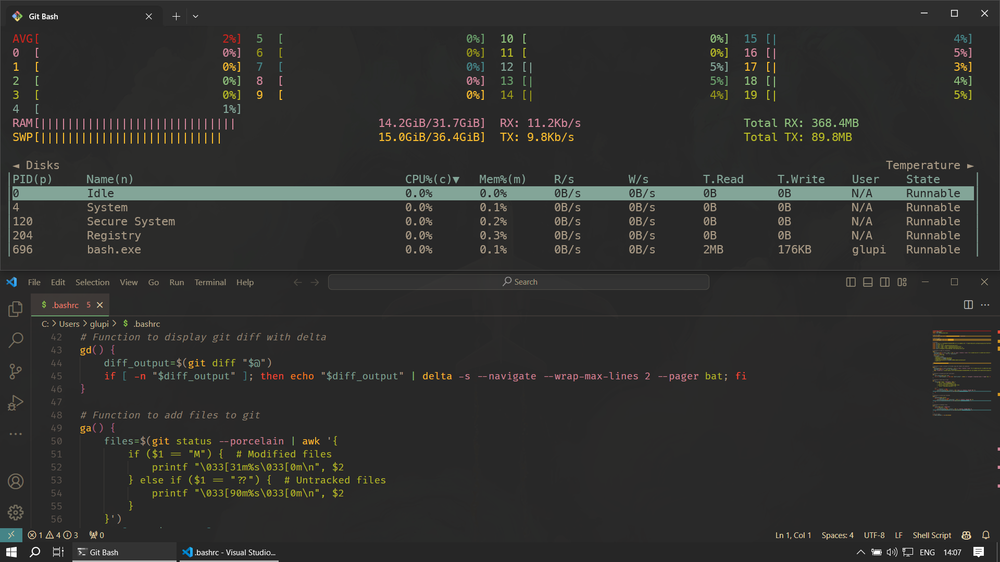

# win-config

This repository contains a collection of configuration files created for my Windows 10 setup.

For development I am prevalently using Virtual Machines (VMs) running Linux by leveraging the SSH remote extension in Visual Studio Code. To maintain consistency in path handling between Windows and Linux systems, I predominantly use Git Bash, which shares the same path separator as Linux. This choice ensures consistency in path handling and command syntax between Windows and Linux systems, minimizing friction during development tasks.

To maintain visual coherence and enhance readability, I opt for a dark theme across various applications. In particular, I utilize the [gruvbox](https://github.com/morhetz/gruvbox) dark theme, which provides a pleasing aesthetic while ensuring comfortable usage across different contexts.

## Gallery

## Dependencies

Here are some of the programs and binaries that I use in this setup.

**Note**: some of the binaries hereby mentioned could mistakenly be identified as malware by certain antivirus software on Windows. If deploying this setup in a corporate environment where security alerts could be triggered, it's advisable to verify each binary with [VirusTotal](https://www.virustotal.com/gui/home/upload) prior to installation, or request your organization to whitelist false positives.

### Recommended Programs

[`Visual Studio Code`](https://code.visualstudio.com/): main code editor

[`Sublime Text`](https://www.sublimetext.com/): alternative code editor and note taking

[`Notepad++`](https://notepad-plus-plus.org/): notepad replacement

[`Windows Terminal`](https://aka.ms/terminal): terminal emulator

[`Git Bash`](https://git-scm.com/downloads): Unix-like shell environment

[`Chrome`](https://www.google.com/chrome/): browser

[`KeePass`](https://keepass.info/): password manager

### Recommended Binaries

[`ble.sh`](https://github.com/akinomyoga/ble.sh): command line editor for `bash`

[`eza`](https://github.com/eza-community/eza): replacement for `ls`

[`bat`](https://github.com/sharkdp/bat): replacement for `cat`

[`fzf`](https://github.com/junegunn/fzf): command-line fuzzy finder

[`ripgrep`](https://github.com/BurntSushi/ripgrep): replacement for `grep`

[`fd`](https://github.com/sharkdp/fd): replacement for `find`

[`delta`](https://github.com/dandavison/delta): pager for git/diff

[`bottom`](https://github.com/ClementTsang/bottom): graphical process/system monitor for the terminal

[`fastfetch`](https://github.com/fastfetch-cli/fastfetch): fetch and display system information

