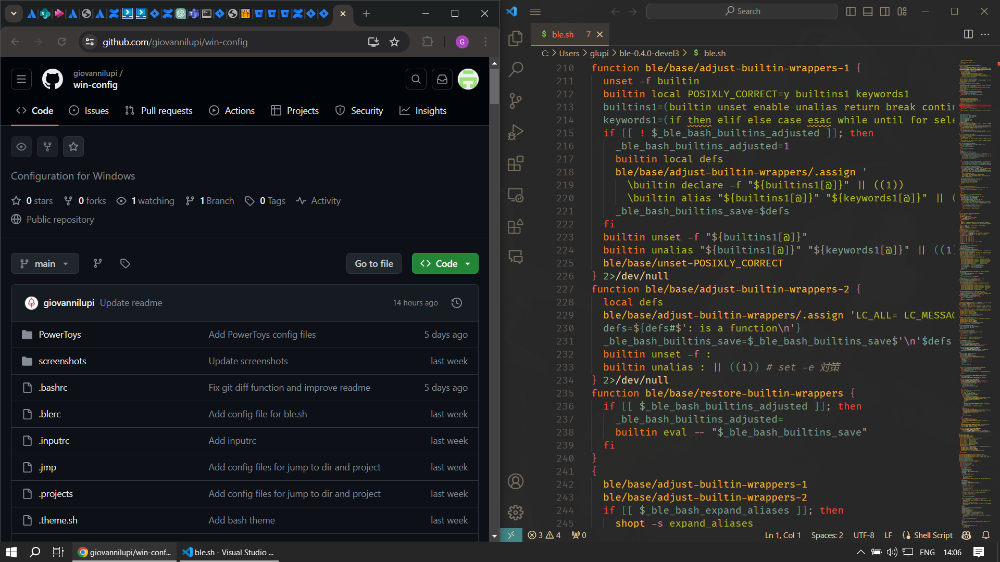

# win-config

This repository contains a collection of configuration files created for my Windows 10 setup.

For development I am prevalently using Virtual Machines (VMs) running Linux by leveraging the [Remote - SSH](https://marketplace.visualstudio.com/items?itemName=ms-vscode-remote.remote-ssh) extension in Visual Studio Code. To maintain consistency in path handling between Windows and Linux systems, I predominantly use [Git Bash](https://gitforwindows.org/), which shares the same path separator as Linux. This choice ensures consistency in path handling and command syntax between Windows and Linux systems, minimizing friction during development tasks.

To maintain visual coherence and enhance readability, I opt for a dark theme across various applications. In particular, I utilize the [gruvbox](https://github.com/morhetz/gruvbox) dark theme, which provides a pleasing aesthetic while ensuring comfortable usage across different contexts.

## Gallery




## Dependencies

Here are some of the programs and binaries that I use in this setup.

**Note**: some of the binaries hereby mentioned could mistakenly be identified as malware by certain antivirus software on Windows. If deploying this setup in a corporate environment where security alerts could be triggered, it's advisable to verify each binary with [VirusTotal](https://www.virustotal.com/gui/home/upload) prior to installation, or request your organization to whitelist false positives.

### Recommended Programs

[`Visual Studio Code`](https://code.visualstudio.com/): main code editor

[`Sublime Text`](https://www.sublimetext.com/): alternative code editor and note taking

[`Notepad++`](https://notepad-plus-plus.org/): notepad replacement

[`Windows Terminal`](https://aka.ms/terminal): terminal emulator

[`Git Bash`](https://git-scm.com/downloads): Unix-like shell environment

[`PowerToys`](https://github.com/microsoft/PowerToys): productivity utilities for Windows

[`Google Chrome`](https://www.google.com/chrome/): browser

[`KeePass`](https://keepass.info/): password manager

### Recommended Binaries

[`ble.sh`](https://github.com/akinomyoga/ble.sh): command line editor for `bash`

[`eza`](https://github.com/eza-community/eza): replacement for `ls`

[`bat`](https://github.com/sharkdp/bat): replacement for `cat`

[`fzf`](https://github.com/junegunn/fzf): command-line fuzzy finder

[`ripgrep`](https://github.com/BurntSushi/ripgrep): replacement for `grep`

[`fd`](https://github.com/sharkdp/fd): replacement for `find`

[`delta`](https://github.com/dandavison/delta): pager for git/diff

[`bottom`](https://github.com/ClementTsang/bottom): graphical process/system monitor for the terminal

[`wget`](https://eternallybored.org/misc/wget/): GNU Wget for Windows

[`fastfetch`](https://github.com/fastfetch-cli/fastfetch): fetch and display system information

## Instructions

Here are some configuration instructions.

### Wallpaper

The wallpaper used in this setup can be found in this repository. Alternatively, you can select any other wallpaper of your choice. To increase the resoultion of drawing-style images, I use the In-Browser version of [waifu2x](https://github.com/nagadomi/waifu2x). To harmonize the chosen image with the gruvbox theme, I use [gruvbox-factory](https://github.com/paulopacitti/gruvbox-factory) within any *nix system.

### Appearance Settings

To maximize screen real estate, I recommend adjusting the taskbar settings to make icons smaller. To do that, right-click any empy space in the taskbar and click <em>Taskbar settings</em>. In this menu, toggle the <em>Use small taskbar buttons</em> to On.
 
By using `Powertoys Run` to open programs, I have effectively removed the need for taskbar icons. Since I prefer a clean look for my desktop, I have removed all of them from my taskbar. I've also adjusted the taskbar settings for a more streamlined interface. In <em>Taskbar settings</em>, I've set:
- <em>Combine taskbar buttons</em>: Never
- <em>Multiple displays</em> > <em>Show taskbar buttons on</em>: Taskbar where windows is open
- <em>Multiple displays</em> > <em>Combine buttons on other taskbars</em>: Never
 
To change the color of the taskbar to fit the gruvbox theme, head to <em>Settings</em> > <em>Personalization</em> > <em>Colors</em>. Here, select the following options:
- <em>Choose you color</em>: Dark
- <em>Transparency effects</em>: Off
- <em>Choose your accent color</em>: #282828
- <em>Show accent color on the following surfaces</em>: Tick all options
 
Depending on your wallpaper, you might achieve a better look by enabling transparency rather than turning it off.

### Other Settings

Showing filename extensions is certainly a must for proper file manipulation. Showing hidden files is also key for having full control of the filesystem. To show both:
1. Open File Explorer
2. Click the <em>View</em> tab in File Explorer
3. Tick <em>File name extensions</em> and <em>Hidden items</em>

I recommend disabling the Windows default <kbd>Ctrl</kbd> + <kbd>Shift</kbd> hotkey for switching keyboard layouts. This key combination is frequently part of shortcuts in several software applications, and having it set for layout switching can cause conflicts. To disable it, follow these steps:
1. Navigate to <em>Language settings</em>.
2. Click on <em>Keyboard</em>.
3. Select <em>Input language hot keys</em>.
4. Set all options to <em>(none)</em>.

### PowerToys

PowerToys is a set of utilities that enhance the functionality of Windows, allowing users to increase their productivity. In my setup, I am using the following utilities:
- [`Always On Top`](https://learn.microsoft.com/en-us/windows/powertoys/always-on-top): pin a window on top of others
- [`PowerToys Awake`](https://learn.microsoft.com/en-us/windows/powertoys/awake): keep computer awake
- [`Environment Variables`](https://learn.microsoft.com/en-us/windows/powertoys/environment-variables): easier environment variables management
- [`FancyZones`](https://learn.microsoft.com/en-us/windows/powertoys/fancyzones): window manager supporting static layouts
- [`Keyboard Manager`](https://learn.microsoft.com/en-us/windows/powertoys/keyboard-manager): redefine keys on your keyboard
- [`Paste As Plain Text`](https://learn.microsoft.com/en-us/windows/powertoys/paste-as-plain-text): paste text excluding formatting using a custom keyboard shortcut
- [`Peek`](https://learn.microsoft.com/en-us/windows/powertoys/peek): preview files directly in in File Explorer
- [`PowerToys Run`](https://learn.microsoft.com/en-us/windows/powertoys/run): program launcher

On Windows, the configuration files for PowerToys are located at `%HomePath%\AppData\Local\Microsoft\PowerToys\Awake\`. To apply this configuration, simply copy the files in the `PowerToys` directory of this repository and paste them there.

`PowerToys Run` stands out as the most valuable tool within the PowerToys suite, enabling swift transition between windows and quick program launch. This feature significantly enhances productivity by enabling users to manage applications through keyboard commands, eliminating the need for mouse interactions. 
\
Note that by default, PowerToys operates by opening a new instance of a program, even if a window is [already open](https://github.com/microsoft/PowerToys/issues/5962). This is in contrast with the behavior of other program launchers like Raycast or Alfred on macOS. To switch to an active instance, you can leverage the WindowWalker plugin by prefixing the name of the program with the `-` chracter. The `-` character can be substituted with any other one of your preference in the settings.

I couldn't locate the specific storage location for `Keyboard Manager` configurations, but I've implemented a single remapping, setting <kbd>Win</kbd> + <kbd>Space</kbd> to <kbd>Win</kbd> + <kbd>Alt</kbd>, which is the default key combination to open `PowerToys Run`. This modification is intended to override the default keyboard layout switch shortcut from Windows and mimic the opening sequence for Raycast on macOS.

To ensure the `Paste As Plain Text` feature works as intended with the keyboard shortcut <kbd>Ctrl</kbd> + <kbd>Shift</kbd> + <kbd>V</kbd>, it's crucial to disable the default keyboard layout switch combination <kbd>Ctrl</kbd> + <kbd>Shift</kbd>. The procedure is explained in the previous Windows settings section. This adjustment allows the custom shortcut to work without interference from the system's default behavior.

### Shell

I use Bash as my primary shell as it provides a multitude of advantages over PowerShell. One standout feature is its seamless integration of Linux commands within the Windows environment. This compatibility proves invaluable as I frequently work with Linux VMs, facilitating the porting of scripts between platforms. Moreover, Bash's utilization of Unix-style path separators (/) simplifies path management in scripts and commands, enhancing overall workflow efficiency.

Installing [Git Bash](https://git-scm.com/downloads) stands out as perhaps the simplest method to bring Bash functionality onto a Windows system. However, Git Bash is more than just Bash compiled for Windows. It's a package that includes Bash, a Perl interpreter, a Git executable, and a suite of other Unix-like utilities such as `ssh`, `scp`, and `cat`. Additionally, Git Bash comes with a terminal emulator called [mintty](https://mintty.github.io/). To enable Bash functionality on Windows, an emulation layer is required, which ensures compatibility between POSIX conventions and the Windows environment. This layer ensures seamless operation, allowing Unix-like paths to be used and translated effectively when interacting with native Windows executables. Underneath, Git Bash leverages [MSYS2](https://www.msys2.org/) as its compatibility layer, enabling it to understand Unix paths and execute commands seamlessly on the Windows platform.

### Bash configuration

MSYS2 stands out as one of the most efficient POSIX emulation layers for Windows. Unlike Cygwin, which prioritizes broad POSIX compatibility, MSYS2 offers a more minimal and lightweight alternative. Nevertheless, this emulation process incurs in a significant performance penalty, that can be noticeable for heavy file-centric software. For instance, the Git package within MSYS2 exhibits slower performance compared to a native git client, especially when handling large volumes of files.

Like any Bash shell, configuration of Git Bash can be achieved through the `.bashrc` file. However, it's crucial to bear in mind the performance implications of this emulation layer. Although additional configurations can enrich functionality, they may also significantly hinder responsiveness and prolong boot times. Thus, it's wise to advocate for minimalist configurations, emphasizing efficiency while preserving essential functionality.

The `.bashrc` profile is located in the home directory. On Windows, the location of this directory might not be immediately apparent. By default, the home directory may be set to a shared network folder, which introduces significant overhead in enumerating files, especially when operating over a VPN. When this is the case, it is possible to solve the issue by changing the value of the `HOME` environment variable in the Windows settings to point to a directory on the local hard drive (e.g. `C:\Users\UserName`). Additionally, ensure that no network directories are included in the `PATH` environment variable, as this can considerably slow down the search for binaries.

In the home directory, I'm including more configuration options within the `.inputrc` file. Here, I enable case-insenstive completion and I disable the visual bell, as it can cause some annoying screen [flickering](https://github.com/microsoft/terminal/issues/7200) when using Git Bash within Windows Terminal and pressing the backspace key.

Numerous plugin managers are available for Bash, such as [Oh My Bash](https://github.com/ohmybash/oh-my-bash) and [Bash-it](https://github.com/Bash-it/bash-it). However, these managers tend to be quite large, potentially increasing shell boot time significantly when sourced in the bash profile. Moreover, I personally find limited value in the available Bash plugins, and I rely mostly on external binaries to add more functionality to the shell. As a consequence, I would suggest refraining from using these managers for this particular setup.

Another issue with plugin managers is that the themes thereby included introduce an overhead that Git Bash struggles to handle. In Bash, the `PS1` environment variable defines the primary prompt string, while `PROMPT_COMMAND` specifies a list of commands to execute just before the prompt appears. Hence, themes work by binding `PROMPT_COMMAND` to a function that updates the value of `PS1` after each command. All the themes included in the plugin managers fetch information from the git status to decorate the prompt. However, in large repositories, this operation can be slow, resulting in very noticeable delays in loading the prompt. To circumvent this problem, I've devised my own theme, which can be sourced directly from `.bashrc` without the need for a plugin manager. This theme is a minimalist version of the [Powerlevel10k lean](https://github.com/romkatv/powerlevel10k/blob/master/config/p10k-lean.zsh) theme. It employs a red color for the separator if the preceding command exited with an error code, and green otherwise. Within Git repositories, it retains the name of the currently used branch, as fetching this information is a fast operation.

In my `.bashrc`, I've included several aliases and functions tailored to my workflow. I generally use [`lf`](https://github.com/gokcehan/lf) file manager for browising through directory, however this appears to behave extremely sluggish on Git Bash. As an alternative, I use the `jmp` function, which allows me to navigate quickly through relevant directories using `fzf`. I use the `gtp` function to select through `fzf` projects located in my VM and open them in VSCode. For improving git commmands, I tipically rely on [`forgit`](https://github.com/wfxr/forgit). However, sourcing it seems to noticeably slow down the shell boot time. Therefore, I've crafted a minimalist version of these functions to enable `fzf` integration.

Lastly, while acknowledging its substantial size and impact on shell boot time, I've integrated [`ble.sh`](https://github.com/akinomyoga/ble.sh) as my command-line editor. I particularly enjoy two key features: syntax highlighting and tab cycling through options. While I've disabled numerous features through the `.blerc` configuration file, some remain unavoidable. Moreover, disabling these features does not diminish the time necessary to source the program. Although `ble.sh` occasionally generates additional output and slows down prompt loading, the trade-off remains acceptable to me. Your decision to include `ble.sh` in your configuration should be based on your valuation of its benefits weighed against its impact on performance.

### Terminal

The Git Bash package includes a terminal emulator called [mintty](http://mintty.github.io/), which, although functional, looks quite outdated and offers very limited customization options. Fortunately, Git Bash can be used with other terminal emulators, and my preferred choice on Windows is [Windows Terminal](https://aka.ms/terminal). This terminal is developed by Microsoft, it is regularly updated, it integrates perfectly with the operating system, and it offers extensive customization capabilities. To add Git Bash as default shell in Windows Terminal, I recommend [this](https://www.commandlinewizardry.com/post/how-to-add-git-bash-to-windows-terminal) guide.

I've included the settings file for my Windows Terminal in this repository. While I typically use the [MesloLGS NF](https://github.com/romkatv/powerlevel10k/blob/master/font.md) font for my terminal, I've found that it sometimes displays incorrectly with a [Powerlevel9k](https://github.com/Powerlevel9k/powerlevel9k) theme I use on my VM. As a workaround, I use the [MesloLGS Nerd Font](https://github.com/ryanoasis/nerd-fonts/tree/master/patched-fonts/Meslo/S) instead. You may want to experiment with both fonts to determine which one works best for your setup.

### Visual Studio Code
 
As editor font, I am using [FiraCode](https://github.com/tonsky/FiraCode) with ligatures enabled. To maintain coherency with my terminal, I use [MesloLGS Nerd Font](https://github.com/ryanoasis/nerd-fonts/tree/master/patched-fonts/Meslo/S) as font for the VSCode integrated terminal. I use Git Bash as the default shell for the integrated terminal. To accommodate this choice, I've adjusted the path separator to '/' when copying relative paths. Additionally, I've configured a few more settings to enable image display within the integrated terminal. Here are some relevant snippets from my `settings.json` file:
```
    "terminal.integrated.fontFamily": "MesloLGS Nerd Font",
    "terminal.integrated.fontSize": 15,
    "editor.fontSize": 15,
    "terminal.integrated.gpuAcceleration": "canvas",
    "terminal.integrated.enableImages": true,
    "editor.fontFamily": "fira code",
    "editor.fontLigatures": true,
    "terminal.integrated.defaultProfile.windows": "Git Bash",
    "explorer.copyRelativePathSeparator": "/",
    "glassit.alpha": 251,
```
For keybindings, I've only set up one custom binding, which toggles the maximized panel using <kbd>ctrl</kbd>+<kbd>shift</kbd>+<kbd>m</kbd>. This binding can be added to the `keybindings.json` file:
```
    "key": "ctrl+shift+m",
    "command": "workbench.action.toggleMaximizedPanel",
```
To maintain a consistent appearance across my workspace I use [this](https://marketplace.visualstudio.com/items?itemName=jdinhlife.gruvbox) gruvbox dark medium theme. I set a moderate transparency level using the [GlassIt](https://marketplace.visualstudio.com/items?itemName=s-nlf-fh.glassit) extension. Some of the other extensions I use in my workflow include: Perl Navigator, ShellCheck, C/C++, Remote - SSH, Remote Explorer, Python, LiveShare, GitLens, GitHub Copilot, and GitHub Copilot Chat.
 
### Sublime Text
 
I use Sublime as alternative code editor (mainly for scripting) and for note taking purposes. For appearance, I am using [this](https://github.com/Briles/gruvbox) gruvbox theme and color scheme. To optimize screen real estate, I've reduced the size of tabs and the status bar using some custom settings (Preferences):
```
    "color_scheme": "gruvbox (Dark) (Medium).sublime-color-scheme",
    "font_size": 16,
    "theme": "gruvbox.sublime-theme",
    "gruvbox_tabs_xxs": true,
    "gruvbox_statusbar_xxs": true,
```

### Notepad++

In Notepad++, I am using the "Gruvbox Dark Medium" theme from [this](https://github.com/wburton95/Notepadpp-Gruvbox-Port) repository. To use it, download the xml file for it from the repository and move into the themes directory of Notepad++. After that, you can apply the theme from the program settings. In the settings, I also adjusted the Dark Mode to "Follow Windows", set the Toolbar to "Filled FluentUI: Small", and changed the font to [FiraCode](https://github.com/tonsky/FiraCode).

### Google Chrome
 
Google Chrome is my default browser, primarily due to its compatibility with several services I utilize. However, if you don't have these specific requirements, I'd recommend Firefox as an alternative. To visually integrate with my setup, I am using [this](hthttps://chromewebstore.google.com/detail/gruvbox-theme/ihennfdbghdiflogeancnalflhgmanop) gruvbox theme. As browsing extensions, I am using uBlock Origin, Windows Accounts, and Adobe Acrobat.
